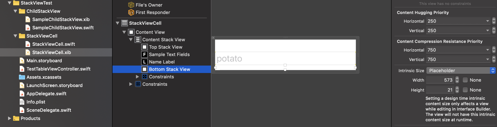
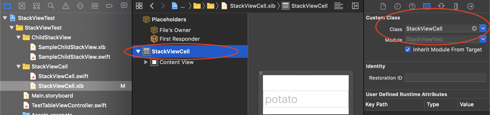
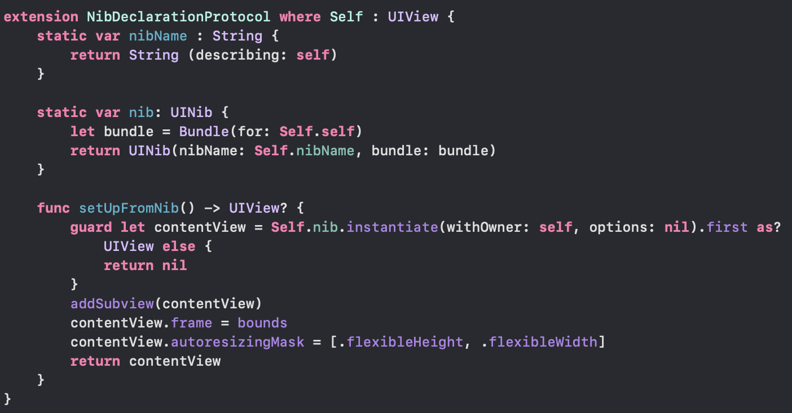
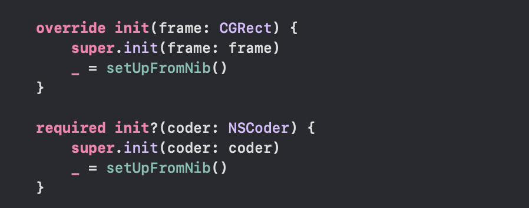
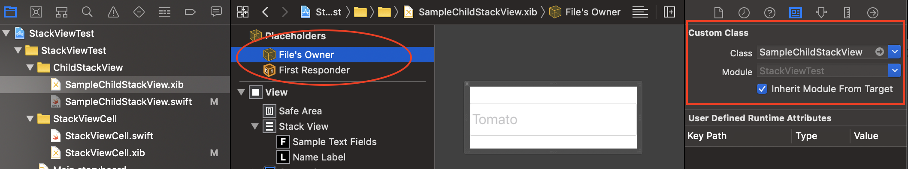

# AutoLayout - Resizing TableViewCell automatically from the hierarchy of stack view within it.

Whats Done in the Project:

1) Have cretated UIView with stack view embedded in it. (SampleChildStackView.swift and SampleChildStackView.xib)
2) Have created custom TableViewCell  which contains a stack view in it.(StackViewCell.swift and StackViewCell.xib)
3) Have embedded the custom UIView (SampleChildStackView) within the  StackViewCell. (Now one stack view holds another stack view.)
4) The parent and child stack view holds label in it. Which will not occupy space while loading.
5) Have added Timer in StackViewCell which set label.hidden is NO and assign text to it. Then once Label is assigned a value, using Delegate passing this message to parent TableViewController and calling Table View [beginUpdate] and [EndUpdate].
6) Now table view will be resized based on the cell content automtically.
7) No Fixed height constraint is used in the sameple.

## Things Learned

>While adding content to stack in Interface builder. Error will be thrown on constraints when Stack View content is set to type "Fill". To fix this add place holder value. (**Hint:** Sometimes setting placeholder for one element wil be fine. If the interface builder throws error adjust the height accordingly. Remeber: This placeholder value will not affect the actual size.)

>For custom TableViewCell created using Xib, the class file name is set for the actual TableViewCell withing Xib and added Identifier in the storyboard. and cell is registered using below code.
let nib = UINib(nibName: "StackViewCell", bundle: nil)
tableView.register(nib, forCellReuseIdentifier: "StackViewCell")

>For cutom UIView created using Xib, the class file name is set for the FileOwner.  In our example SampleChildStackView is UIView. 

